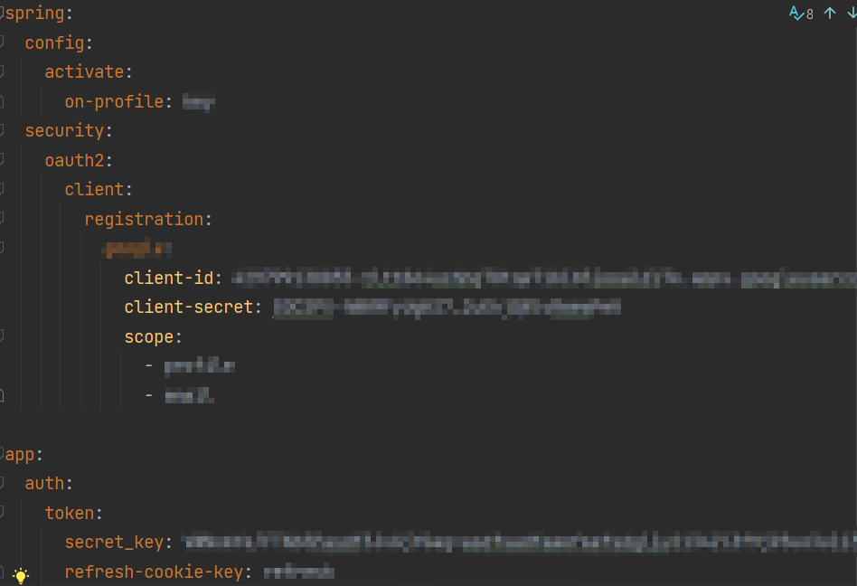

# 목차

## 0. 팀원 소개


## 1. 서비스 소개


나이를 불문하고 넓은 연령대에게 사랑을 받은 뜨개질을 초심자도 쉽게 접근할 수 있도록 3D자료를 제공하고 다양한 뜨개질 도안을 추천하여 많은 사람들이 뜨개질에 접근성을 낮추기 위한 빅데이터 추천 서비스

### 타깃

- 뜨개질을 시작하는 입문반
- 다양한 도안을 추천 받고 싶은 취미반
- 모여서 뜨개질을 하고 싶은 사람들

### 주요기능

1. 컨텐츠를 기반으로 도안 추천
2. 실기반 도안 추천
3. 사용자 기반 도안 추천
4. 입문자를 위한 뜨개질 기본 기술 3D강의
5. 뜨개질 커뮤니티 기능
    5.1 자랑글 게시판
    5.2 소모임 게시판
    5.3 질문 게시판
6. 주간 베스트 기능
7. 도안 좋아요, 사용자 좋아요.

---

## 2. 개발환경

- 서버 도메인

```jsx
j8c201.p.ssafy.io
```

| 소프트웨어 | version | 상세 |
| --- | --- | --- |
| Java SE | JDK8 |  |
| Swagger | Springfox |  |
| Gradle | - |  |
| Spring boot | 2.7.x |  |
| Spring cloud | 2021.0.x aka Jubilee | https://spring.io/projects/spring-cloud |
| JPA | - |  |
| OpenFeign |  |  |
| database [mysql] | 8.0.31 |  |
| Redis | 6.x | 용도 : session 클러스터링 |
| Python |  |  |
| Django | 4.1.7 |  |
| React | 18.2.0 |  |

## 3. 빌드 방법


### gitignore

application-key.yml



### git 컨벤션

| 커밋유형 | 의미 |
| --- | --- |
| feat | 새로운 기능 추가 |
| fix | 버그 수정 |
| docs | 문서 수정 |
| style | 코드 formatting, 세미콜론 누락, 코드 자체의 변경이 없는 경우 |
| refactor | 코드 리팩토링 |
| test | 테스트 코드, 리팩토링 테스트 코드 추가 |
| chore | 패키지 매니저 수정, 그 외 기타 수정 ex) .gitignore |
| design | CSS 등 사용자 UI 디자인 변경 |
| comment | 필요한 주석 추가 및 변경 |
| rename | 파일 또는 폴더 명을 수정하거나 옮기는 작업만인 경우 |
| remove | 파일을 삭제하는 작업만 수행한 경우 |
| !BREAKING CHANGE | 커다란 API 변경의 경우 |
| !HOTFIX | 급하게 치명적인 버그를 고쳐야 하는 경우 |

## 4. 외부 기술
[BE]
- Spring: [security][securitylink]

[securitylink]: ./exec/tech/SPRING/Spring%20Security.md

- Spring: [jwt][jwtlink]

[jwtlink]: ./exec/tech/JWT/spring_jwt.md

- container: [docker][dockerlink]

[dockerlink]: ./exec/tech/Docker/docker.md

- CI/CD: [jenkink][jenkinslink]

[jenkinslink]: ./exec/tech/Jenkins/jenkins%2094b7ac670a1d47ae9201e58604d7ab1d.md

[FE]
- 3D tutorial : Three.js(https://threejs.org/)
- Gsap(https://greensock.com/gsap/)
- 색 조합 추천 : extract colors(https://extract-colors.namide.com/)
- simpler color(https://github.com/arnelenero/simpler-color#readme)
- 커뮤니티 : React Quill(https://github.com/zenoamaro/react-quill)
- 상태관리 : Recoil (https://recoiljs.org/)
## &#128187; 5. 사용자 인터페이스
---
### 1) 메인페이지


### 2) 추천페이지
- 추천 페이지 메인


- 키워드 기반 패턴 추천


- 실 정보 기반 패턴 추천


- 이미지 기반 색상 조합 추천
 


- 추천 결과 페이지


### 3) 튜토리얼 페이지
- 튜토리얼 페이지 메인
-

- 스크롤 애니메이션을 이용한 뜨개질 설명


- three.js를 이용해 상호작용을 통한 뜨개질 단계 360도 확인


### 4) 커뮤니티 페이지

- 도안 자랑글 작성 페이지


- 도안 자랑글 디테일 페이지


- 도안 리스트 페이지


- 소모임/ 질문 작성 페이지
 

- 소모임/질문 디테일 페이지


- 리스트 페이지


