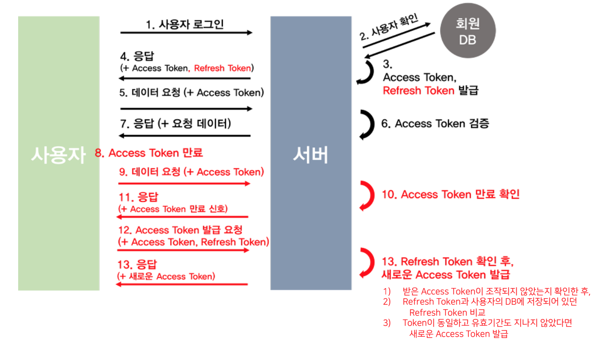

# JWT

# JWT ( Json Web Token ) 이란?

JWT 는 유저를 인증하고 식별하기 위한 **토큰(Token)**기반 인증이다. 

```java
⚠️ [RFC 7519](https://datatracker.ietf.org/doc/html/rfc7519) 에 자세한 명세가 나와있다.
```

토큰은 세션과는 달리 서버가 아닌 **클라이언트에 저장**되기 때문에 메모리나 스토리지 등을 통해 세션을 관리했던 서버의 부담을 덜 수 있다. 

🗨️ JWT 가 가지는 핵심적인 특징이 있다면, **토큰 자체에 사용자의 권한 정보나 서비스를 사용하기 위한 정보가 포함(Self-contained)**된다는 것이다. 

🚧 데이터가 많아지면 토큰이 커질 수 있으며 토큰이 한 번 발급된 이후 사용자의 정보를 바꾸더라도 토큰을 재발급하지 않는 이상 반영되지 않는다.

JWT 를 사용하면 RESTful 과 같은 **무상태(Stateless)**인 환경에서 사용자 데이터를 주고 받을 수 있음

세션(Session)을 사용하게 될 경우에는 쿠키 등을 통해 식별하고 서버에 세션을 저장했지만 JWT 와 같은 토큰을 클라이언트에 저장하고 요청시 단순히 HTTP 헤더에 토큰을 첨부하는 것만으로도 단순하게 데이터를 요청하고 응답을 받아올 수 있다.

일반적으로 JWT 를 사용하면 아래와 같은 순서로 진행된다.

1. 클라이언트 사용자가 아이디, 패스워드를 통해 웹서비스 인증.
2. 서버에서 **서명된(Signed)** JWT 를 생성하여 클라이언트에 응답으로 돌려주기.
3. 클라이언트는 응답받은 JWT를 저장관리하게 된다.
4. 클라이언트가 서버에 데이터를 추가적으로 요구할 때 JWT 를 HTTP Header 에 첨부.
5. 서버에서 클라이언트로부터 온 JWT 를 검증.

JWT 는 JSON 데이터를 **Base64 URL-safe Encode** 를 통해 인코딩하여 직렬화한 것이 포함되며 토큰 내부에는 위변조 방지를 위해 개인키를 통한 **전자서명**도 있다. 

따라서 사용자가 JWT 를 서버로 전송하면 서버는 **서명을 검증하는 과정**을 거치게 되며 검증이 완료되면 요청한 응답을 돌려준다.

### **Base64 URL-safe Encode**

```java
public void afterPropertiesSet() throws Exception {
    byte[] keyBytes = Decoders.BASE64.decode(secret);
    this.key = Keys.hmacShaKeyFor(keyBytes);
}
```

위에서 사용한 key는 JWT 토큰을 검증할 때 사용됩니다.!!

### JWT 구조는?

JWT는 Header, Payload, Signature 로 구성되어 있습니다.

```
🗣️ Header : JWT에서 사용할 **타입**과 해시 **알고리즘의 종류**가 담겨 있습니다.

💰 Payload : 서버에서 첨부한 사용자 **권한 정보**와 **데이터**가 담겨 있습니다.

®️ Signature : Header, Payload를 `Base64 URL-safe Encode` 를 한 이후 
								Header 에 명시된 해시함수를 명시하고, 
								개인키(Private Key)를 서명한 **전자서명**이 담겨있습니다.
```

### 토큰의 역사?

인증 토큰을 사용하기 전에는 비밀번호와 서버가 사용되었습니다. 기존 방식을 사용해 적합한 사람이 필요할 때 원하는 정보에 액세스했는지 확인해야 했지만 항상 효과적이지는 못했습니다.

🗯️ 문제1

비밀번호를 예로 들면, 일반적으로 다음과 같은 과정이 작용합니다.

- **사용자 생성.** 문자, 숫자, 기호를 조합하여 비밀번호를 생성합니다.
- **기억.** 고유한 비밀번호 조합을 항상 기억해야 합니다.
- **반복.** 액세스가 필요할 때마다 비밀번호를 입력해야 합니다.

🗯️ 문제2

유저들은 비밀번호를 일일이 다 기억하지 못하며, 다음과 같은 요령에 의지하는 경우가 많습니다.

- **비밀번호 기록.** 비밀번호가 빼곡히 적힌 종이를 분실할 경우 보안 악몽이 시작됩니다.
- **비밀번호 재사용.** 사람들은 동일한 비밀번호를 여러 계정에서 사용하는 경향이 있습니다. 따라서 한 개의 비밀번호가 분실될 경우 대부분의 계정이 취약해질 수 있습니다.
- **부분적인 비밀번호 변경.** 사람들은 비밀번호를 업데이트해야 할 때 문자나 숫자를 하나만 변경합니다.

비밀번호 역시 서버 인증이 필요합니다. 

사람들이 로그인할 때마다 컴퓨터가 트랜잭션 **레코드를 생성**하며, 

❗❗결과적으로 **메모리 부하가 증가**합니다.

### JWT의 장점 과 단점

💙 장점

- **크기:** JSON 코드 언어로 생성된 토큰은 용량이 작기 때문에 두 엔티티 사이에서 매우 빠르게 전달됩니다.

- **용이성:** 거의 모든 곳에서 토큰이 생성될 수 있으며, 서버에서 토큰을 확인할 필요가 없습니다.

- **제어:** 액세스 가능한 데이터, 권한 지속 시간, 로그인 시 가능한 작업을 지정할 수 있습니다.

❤️ 단점

- **단일 키:** JWT는 단일 키를 이용합니다. 따라서 **키가 유출**되면 시스템 전체가 위험에 노출됩니다.

- **복잡성:** 이 토큰은 이해하기가 쉽지 않습니다. 개발자가 암호 서명 알고리즘에 정통하지 않다면 자신도 모르게 시스템을 위험에 빠뜨릴 수 있습니다.

- **제한:** 메시지를 모든 클라이언트에게 푸시할 수 없고, 서버 측 클라이언트도 관리할 수 없습니다.

---

### Refresh & Access Token 이용한 JWT



### 참조 사이트

[JWT(JSON Web Token)의 개념부터 구현까지 알아보기](https://pronist.dev/143#JWT(JSON%20Web%20Token)-1)