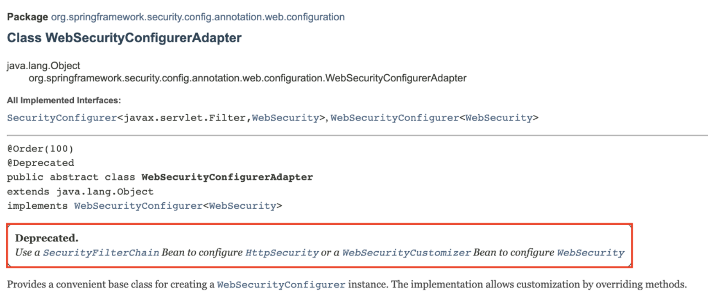

# Spring Security

## Security란?

Spring Security는 Spring과는 별개로 작동하는 보안담당 프레임워크이다.

크게 두 가지의 동작을 수행한다.

1. Authenticatio(인증) : 특정 대상이 "누구"인지 확인하는 절차이다.

2. Authorization(인가) : 인증된 주체가 특정한 곳에 접근 권한을 확인하는 것이다.

## Security 설정하기

### 라이브러리 설치하기 ( maven 기준 )

```xml
<dependency>
    <groupId>org.springframework.boot</groupId>
    <artifactId>spring-boot-starter-security</artifactId>
</dependency>
```

### securityConfig 클래스 설정하기

```java
@Configuration
@EnableWebSecurity
public class SecurityConfig extends WebSecurityConfigurerAdapter {
	...
}
```

@EnableWebSecurity 어노테이션을 설정해주세요!

WebSecurityConfigurerAdapter 클래스를 상속(extends) 받아서 필요한 메소드를 오버라이딩 해주세요.

- 설정 메소드
    
    ### 인증 관련 메소드
    
    ```java
    @Override
    protected void configure(AuthenticationManagerBuilder auth) throws Exception {
    	...
    }
    ```
    
    ### http 접근 관련 메소드
    
    ```java
    @Override
    protected void configure(HttpSecurity http) throws Exception {
    	...
    }
    ```
    
    ### web 관련 메소드
    
    ```java
    @Override
    public void configure(WebSecurity web) throws Exception {
    	...
    }
    ```
    

⚠️ WebSecurityConfigurerAdapter 가 deprecated 되어서 이제는 아래와 같이 설정해 주세요.



```java
SecurityFilterChain을 Bean으로 설정하거나 
WebSecurityCustomizer을 Bean으로 등록해서 사용해주세요.
```

### SecurityFilterChain을 Bean으로 등록

```java
@Configuration
public class SecurityConfig {
	
	@Bean
	public SecurityFilterChain filterChain(HttpSecurity http) throws Exception {
		...
	}
}
```

### WebSecurityCustomizer을 Bean으로 등록

```java
@Configuration
public class SecurityConfig {
	
		@Bean
    public WebSecurityCustomizer webSecurityCustomizer() {
        return (web) -> web.ignoring().antMatchers("/ignore1", "/ignore2");
    }
}
```

좀 더 자세한 내용은 [공식문서](https://spring.io/blog/2022/02/21/spring-security-without-the-websecurityconfigureradapter)를 보면서 확인해주세요.

[Spring Security without the WebSecurityConfigurerAdapter](https://spring.io/blog/2022/02/21/spring-security-without-the-websecurityconfigureradapter)

## Security 커스터마이징

### Inmemory 방식

`— 미작성 —`

### PasswordEncoding

`— 미작성 —`

## Security Test

`— 미작성 —`

## Security Architecture

### SecurityContextHolder 와 Authentication관계 (1)


💮 **Authentication**

Principal 과 GrantAuthority 제공

🤖 **Principal**

‘누구’에 해당하는 ℹ️ **정보**

UserDetailsService에서 리턴한 객체

UserDetailsService를 구현한 클래스에서 재정의한 `loadUserByUsername` 가 리턴한 객체

객체의 타입 `UserDetails` 

🔌 **GrantAuthority**

Principal이 가지고 있는 ‘권한’을 나타낸다.

인증 이후, 인가 및 권한 확인할 때 이 정보를 참조한다.

👤 **UserDetails**

애플리케이션이 가지고있는 유저 정보와 스프링 시큐리티가 사용하는 Authentication 객체 사이 어댑터.

🛎️ **UserDetailsService**

유저 정보를 UserDetails 타입으로 가져오는 DAO(Data Access Object) 인터페이스

### AuthenticationManager 와 Authentication 관계

🥅 실제로 Authentication을 만들고 인증을 처리하는 관리자 `AuthenticationManager` 가 담당한다. 

- 인자로 받은 Authentication이 유효한 인증인지 확인하고 Authentication 객체를 리턴한다.
- 인증을 확인하는 과정에서 비활성 계정, 잘못된 비번, 잠긴 계정 등의 에러를 던질 수 있다.

### SecurityContextHolder 와 Authentication 관계 (2)

의문1) 인증이 완료된 Authentication 객체가 😒 언제? SecurityContextHolder에 들어갔는가?

의문2) 새로운 요청(request)를 보내도 같은 객체를 리턴 하는데 어떻게 그렇게 되는가?

## **Spring Security Filter**

스프링 시큐리티는 필터를 기반으로 수행된다*.*

> 필터와 인터셉터의 차이는 실행되는 시점의 차이이다.
> 
> - 필터는 dispatcher servlet으로 요청이 도착하기 전에 동작한다.
> - 인터셉터는 dispatcher servlet을 지나고 controller에 도착하기 전에 동작한다.

Spring Security Filter는 `FilterChainProxy` 를 호출해서 총 15개의 필터를 순차적으로 실행한다.

1. WebAsyncManagerIntergrationFilter
2. **SecurityContextPersistenceFilter**
3. HeaderWriterFilter
4. CsrfFilter
5. LogoutFilter
6. **UsernamePasswordAuthenticationFilter**
7. DefaultLoginPageGeneratingFilter
8. DefaultLogoutPageGeneratingFilter
9. BasicAuthenticationFilter
10. RequestCacheAwareFtiler
11. SecurityContextHolderAwareReqeustFilter
12. AnonymouseAuthenticationFilter
13. SessionManagementFilter
14. ExeptionTranslationFilter
15. **FilterSecurityInterceptor**

### DelegatingFilterProxy 와 FilterChainProxy

DelegatingFilterProxy

- 일반적인 서블릿 필터.
- 서블릿 필터 처리를 스프링에 들어있는 빈으로 위임하고 싶을 때 사용하는 서블릿 필터.
- 타겟 빈 이름을 설정한다.
- 스프링 부트 없이 스프링 시큐리티 설정할 때는 AbstractSecurityWebApplicationInitializer를 사용해서 등록.
- 스프링 부트를 사용할 때는 자동으로 등록 된다. (SecurityFilterAutoConfiguration)

FilterChainProxy

- 보통 “springSecurityFilterChain” 이라는 이름의 빈으로 등록된다. ( springboot )


### FilterSecurityInterceptor

`— 미작성 —`

### ExceptionTranslationFilter

`— 미작성 —`

### 스프링 아키텍쳐 정리


## Spring Web Appication

- ⚠️ favicon.ico
    
    ```
    
    ```
    

### ignoring (1)

security에서 처리하고 싶지않는 static 요청들을 무시하고 싶다면 `WebSecurity` 를 이용해서 무시할 수 있음

```java
@Override
public void configure(WebSecurity web) throws Exception {
	web.ignoring().requestMatchers(PathRequest.toStaticResources().atCommonLocations());
}
```

❗왜 무시를 하느냐? ⇒ 이러한 요청으로 인해서 서버의 자원을 사용하게 되고, 그만큼 시간도 소비하기 때문에